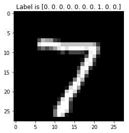
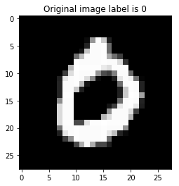
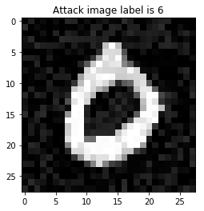

# 2.4 Try out the MNIST dataset


```python
import numpy as np
from matplotlib import pyplot as plt
from tensorflow.examples.tutorials.mnist import input_data
import tensorflow as tf
mnist = input_data.read_data_sets("/tf/data/mnist/", one_hot=True)
image = mnist.test.images[0]
image_class = mnist.test.labels[0]
image_2d = image.reshape(28, 28)
plt.title('Label is {label}'.format(label=image_class ))
plt.imshow(image_2d, cmap='gray')
plt.show()
```

    Extracting /tf/data/mnist/train-images-idx3-ubyte.gz
    Extracting /tf/data/mnist/train-labels-idx1-ubyte.gz
    Extracting /tf/data/mnist/t10k-images-idx3-ubyte.gz
    Extracting /tf/data/mnist/t10k-labels-idx1-ubyte.gz





# 3.1 Try out the tensorflow computational graph concept


```python
import tensorflow as tf
# define computational graph
a = tf.placeholder(tf.int16)
b = tf.placeholder(tf.int16)
add = tf.add(a, b)
mul = tf.multiply(a, b)
# process data using previously defined computational graph
with tf.Session() as sess:
    add_result = sess.run(add, feed_dict={a: 2, b: 3})
    mul_result = sess.run(mul, feed_dict={a: 2, b: 3})
    print (add_result, mul_result)
```

    5 6


# 4.3 Feedforward -- get the output of the neural network for an image


```python
import tensorflow as tf

# variables
x = tf.placeholder(tf.float32, [1, 784])
y = tf.placeholder(tf.float32, [1, 10])
w_1 = tf.Variable(tf.truncated_normal([784, 128]))
b_1 = tf.Variable(tf.truncated_normal([1, 128]))
w_2 = tf.Variable(tf.truncated_normal([128, 10]))
b_2 = tf.Variable(tf.truncated_normal([1, 10]))
# computational graph
def sigma(x):
   return tf.div(tf.constant(1.0), tf.add(tf.constant(1.0),
        tf.exp(tf.negative(x))))

a_0 = x

z_1 = tf.add(tf.matmul(a_0, w_1), b_1)
a_1 = sigma(z_1)
z_2 = tf.add(tf.matmul(a_1, w_2), b_2)
a_2 = sigma(z_2)
# a: output of the feedforward neural network with input data x
a = a_2
# accuracy
acct_mat = tf.equal(tf.argmax(a, 1), tf.argmax(y, 1))
acct_res = tf.reduce_sum(tf.cast(acct_mat, tf.float32))


# load images
mnist = input_data.read_data_sets("/tf/data/mnist/", one_hot=True)
one_image, one_class = mnist.train.next_batch(1)
# run session
with tf.Session() as sess:
    sess.run(tf.global_variables_initializer())
    [acct_res_output, a_output] = sess.run([acct_res, a],
         feed_dict={ x : one_image, y : one_class })
    print(acct_res_output, a_output)
    
    
```

    WARNING:tensorflow:From /usr/local/lib/python3.5/dist-packages/tensorflow/python/framework/op_def_library.py:263: colocate_with (from tensorflow.python.framework.ops) is deprecated and will be removed in a future version.
    Instructions for updating:
    Colocations handled automatically by placer.
    WARNING:tensorflow:From <ipython-input-5-07d416aba8e1>:14: div (from tensorflow.python.ops.math_ops) is deprecated and will be removed in a future version.
    Instructions for updating:
    Deprecated in favor of operator or tf.math.divide.
    Extracting /tf/data/mnist/train-images-idx3-ubyte.gz
    Extracting /tf/data/mnist/train-labels-idx1-ubyte.gz
    Extracting /tf/data/mnist/t10k-images-idx3-ubyte.gz
    Extracting /tf/data/mnist/t10k-labels-idx1-ubyte.gz
    0.0 [[9.2961675e-01 7.2264381e-02 3.4885317e-05 9.9746823e-01 5.1104987e-01
      5.6633973e-05 3.1649289e-03 1.2937497e-01 4.0689331e-01 3.0015867e-02]]


# 5.5 Backpropagation -- find better values for the parameters of the neural network


```python
import tensorflow as tf
from tensorflow.examples.tutorials.mnist import input_data
import numpy as np

tf.reset_default_graph()

# variables
x = tf.placeholder(tf.float32, [ None, 784])
y = tf.placeholder(tf.float32, [ None, 10])
w_1 = tf.Variable(tf.truncated_normal([784, 128]))
b_1 = tf.Variable(tf.truncated_normal([1, 128]))
w_2 = tf.Variable(tf.truncated_normal([128, 10]))
b_2 = tf.Variable(tf.truncated_normal([1, 10]))
# computational graph
def sigma(x):
   return tf.div(tf.constant(1.0), tf.add(tf.constant(1.0),
        tf.exp(tf.negative(x))))
a_0 = x
z_1 = tf.add(tf.matmul(a_0, w_1), b_1)
a_1 = sigma(z_1)
z_2 = tf.add(tf.matmul(a_1, w_2), b_2)
a_2 = sigma(z_2)
# a: output of the feedforward neural network with input data x
a = a_2
# accuracy
acct_mat = tf.equal(tf.argmax(a, 1), tf.argmax(y, 1))
acct_res = tf.reduce_sum(tf.cast(acct_mat, tf.float32))


# define gradients
def sigmaprime(x):
    return tf.multiply(sigma(x), tf.subtract(tf.constant(1.0), sigma(x)))
delta_2 = tf.multiply(tf.subtract(a_2, y), sigmaprime(z_2))
d_b_2 = delta_2
d_w_2 = tf.matmul(tf.transpose(a_1), delta_2)
delta_1 = tf.matmul(delta_2, tf.transpose(w_2))
delta_1 = tf.multiply(sigmaprime(z_1), delta_1)
d_b_1 = delta_1
d_w_1 = tf.matmul(tf.transpose(a_0), delta_1)
# function calls to update parameters
eta = tf.constant(0.5)
step = [
    tf.assign(w_1, tf.subtract(w_1, tf.multiply(eta, d_w_1))),
    tf.assign(b_1, tf.subtract(b_1, tf.multiply(eta,
                               tf.reduce_mean(d_b_1, axis=[0])))),
    tf.assign(w_2, tf.subtract(w_2, tf.multiply(eta, d_w_2))),
    tf.assign(b_2, tf.subtract(b_2, tf.multiply(eta,
                               tf.reduce_mean(d_b_2, axis=[0]))))
]
# load, run, and save
mnist = input_data.read_data_sets("/tf/data/mnist/", one_hot=True)
saver = tf.train.Saver()
with tf.Session() as sess:
    sess.run(tf.global_variables_initializer())
    for i in range(20000):
        # load images
        images, classes = mnist.train.next_batch(10)
        sess.run(step, feed_dict = {x: images, y: classes})
        if i % 1000 == 0:
            res = sess.run(acct_res, feed_dict =
                           {x: mnist.test.images[:1000],
                            y : mnist.test.labels[:1000]})
            print (i/1000, res)
    print ('done learning')
    save_path = saver.save(sess, "/tf/data/mnist-2-layer-model/model.ckpt")


```

    Extracting /tf/data/mnist/train-images-idx3-ubyte.gz
    Extracting /tf/data/mnist/train-labels-idx1-ubyte.gz
    Extracting /tf/data/mnist/t10k-images-idx3-ubyte.gz
    Extracting /tf/data/mnist/t10k-labels-idx1-ubyte.gz
    0.0 80.0
    1.0 414.0
    2.0 504.0
    3.0 514.0
    4.0 567.0
    5.0 602.0
    6.0 662.0
    7.0 699.0
    8.0 743.0
    9.0 770.0
    10.0 792.0
    11.0 828.0
    12.0 849.0
    13.0 860.0
    14.0 866.0
    15.0 860.0
    16.0 863.0
    17.0 863.0
    18.0 869.0
    19.0 867.0
    done learning


# 5.6 Try out the Keras API -- much easier


```python
from tensorflow.examples.tutorials.mnist import input_data
from tensorflow.keras.models import Sequential
from tensorflow.keras.layers import Dense
# create model
model = Sequential()
model.add(Dense(128, input_dim=784, activation='sigmoid'))
model.add(Dense(10, activation='sigmoid'))
#compile model
model.compile(loss='mean_squared_error', optimizer='sgd', metrics=['accuracy'])


mnist = input_data.read_data_sets("/tf/data/mnist/", one_hot=True)
X = mnist.train.images
Y = mnist.train.labels
# Fit the model

model.fit(X, Y, epochs=1, batch_size=10)
# evaluate the model
scores = model.evaluate(X, Y)
print("\n%s: %.2f%%" % (model.metrics_names[1], scores[1]*100))
```

    WARNING:tensorflow:From <ipython-input-4-6064474f7c9a>:12: read_data_sets (from tensorflow.contrib.learn.python.learn.datasets.mnist) is deprecated and will be removed in a future version.
    Instructions for updating:
    Please use alternatives such as official/mnist/dataset.py from tensorflow/models.
    WARNING:tensorflow:From /usr/local/lib/python3.5/dist-packages/tensorflow/contrib/learn/python/learn/datasets/mnist.py:260: maybe_download (from tensorflow.contrib.learn.python.learn.datasets.base) is deprecated and will be removed in a future version.
    Instructions for updating:
    Please write your own downloading logic.
    WARNING:tensorflow:From /usr/local/lib/python3.5/dist-packages/tensorflow/contrib/learn/python/learn/datasets/mnist.py:262: extract_images (from tensorflow.contrib.learn.python.learn.datasets.mnist) is deprecated and will be removed in a future version.
    Instructions for updating:
    Please use tf.data to implement this functionality.
    Extracting /tf/data/mnist/train-images-idx3-ubyte.gz
    WARNING:tensorflow:From /usr/local/lib/python3.5/dist-packages/tensorflow/contrib/learn/python/learn/datasets/mnist.py:267: extract_labels (from tensorflow.contrib.learn.python.learn.datasets.mnist) is deprecated and will be removed in a future version.
    Instructions for updating:
    Please use tf.data to implement this functionality.
    Extracting /tf/data/mnist/train-labels-idx1-ubyte.gz
    WARNING:tensorflow:From /usr/local/lib/python3.5/dist-packages/tensorflow/contrib/learn/python/learn/datasets/mnist.py:110: dense_to_one_hot (from tensorflow.contrib.learn.python.learn.datasets.mnist) is deprecated and will be removed in a future version.
    Instructions for updating:
    Please use tf.one_hot on tensors.
    Extracting /tf/data/mnist/t10k-images-idx3-ubyte.gz
    Extracting /tf/data/mnist/t10k-labels-idx1-ubyte.gz
    WARNING:tensorflow:From /usr/local/lib/python3.5/dist-packages/tensorflow/contrib/learn/python/learn/datasets/mnist.py:290: DataSet.__init__ (from tensorflow.contrib.learn.python.learn.datasets.mnist) is deprecated and will be removed in a future version.
    Instructions for updating:
    Please use alternatives such as official/mnist/dataset.py from tensorflow/models.
    WARNING:tensorflow:From /usr/local/lib/python3.5/dist-packages/tensorflow/python/ops/math_ops.py:3066: to_int32 (from tensorflow.python.ops.math_ops) is deprecated and will be removed in a future version.
    Instructions for updating:
    Use tf.cast instead.
    55000/55000 [==============================] - 3s 63us/sample - loss: 0.0932 - acc: 0.2601
    55000/55000 [==============================] - 1s 10us/sample - loss: 0.0869 - acc: 0.3639
    
    acc: 36.39%


# 6.1 Feedforward on more than one image from a saved model


```python
import tensorflow as tf
from tensorflow.examples.tutorials.mnist import input_data
import numpy as np

tf.reset_default_graph()

# variables
x = tf.placeholder(tf.float32, [ None, 784])
y = tf.placeholder(tf.float32, [ None, 10])
w_1 = tf.Variable(tf.truncated_normal([784, 128]))
b_1 = tf.Variable(tf.truncated_normal([1, 128]))
w_2 = tf.Variable(tf.truncated_normal([128, 10]))
b_2 = tf.Variable(tf.truncated_normal([1, 10]))
# computational graph
def sigma(x):
   return tf.div(tf.constant(1.0), tf.add(tf.constant(1.0),
        tf.exp(tf.negative(x))))
a_0 = x
z_1 = tf.add(tf.matmul(a_0, w_1), b_1)
a_1 = sigma(z_1)
z_2 = tf.add(tf.matmul(a_1, w_2), b_2)
a_2 = sigma(z_2)
# a: output of the feedforward neural network with input data x
a = a_2
# accuracy
acct_mat = tf.equal(tf.argmax(a, 1), tf.argmax(y, 1))
acct_res = tf.reduce_sum(tf.cast(acct_mat, tf.float32))


# load images
mnist = input_data.read_data_sets("/tf/data/mnist/", one_hot=True)
images = mnist.test.images[:1000]
classes = mnist.test.labels[:1000]

# run session
with tf.Session() as sess:
    saver = tf.train.Saver()
    sess.run(tf.global_variables_initializer())
    saver.restore(sess, "/tf/data/mnist-2-layer-model/model.ckpt")
    [acct_res_output, a_output] = sess.run([acct_res, a], feed_dict={ x : images, y : classes })
    print(acct_res_output)


```

    Extracting /tf/data/mnist/train-images-idx3-ubyte.gz
    Extracting /tf/data/mnist/train-labels-idx1-ubyte.gz
    Extracting /tf/data/mnist/t10k-images-idx3-ubyte.gz
    Extracting /tf/data/mnist/t10k-labels-idx1-ubyte.gz
    INFO:tensorflow:Restoring parameters from /tf/data/mnist-2-layer-model/model.ckpt
    862.0


# 6.2 Try some random noise on the images


```python
import tensorflow as tf
from tensorflow.examples.tutorials.mnist import input_data
import numpy as np
from matplotlib import pyplot as plt

tf.reset_default_graph()

# variables
x = tf.placeholder(tf.float32, [ None, 784])
y = tf.placeholder(tf.float32, [ None, 10])
w_1 = tf.Variable(tf.truncated_normal([784, 128]))
b_1 = tf.Variable(tf.truncated_normal([1, 128]))
w_2 = tf.Variable(tf.truncated_normal([128, 10]))
b_2 = tf.Variable(tf.truncated_normal([1, 10]))
# computational graph
def sigma(x):
   return tf.div(tf.constant(1.0), tf.add(tf.constant(1.0),
        tf.exp(tf.negative(x))))
a_0 = x
z_1 = tf.add(tf.matmul(a_0, w_1), b_1)
a_1 = sigma(z_1)
z_2 = tf.add(tf.matmul(a_1, w_2), b_2)
a_2 = sigma(z_2)
# a: output of the feedforward neural network with input data x
a = a_2
# accuracy
acct_mat = tf.equal(tf.argmax(a, 1), tf.argmax(y, 1))
acct_res = tf.reduce_sum(tf.cast(acct_mat, tf.float32))


# define gradients
def sigmaprime(x):
    return tf.multiply(sigma(x), tf.subtract(tf.constant(1.0), sigma(x)))
delta_2 = tf.multiply(tf.subtract(a_2, y), sigmaprime(z_2))
d_b_2 = delta_2
d_w_2 = tf.matmul(tf.transpose(a_1), delta_2)
delta_1 = tf.matmul(delta_2, tf.transpose(w_2))
delta_1 = tf.multiply(sigmaprime(z_1), delta_1)
d_b_1 = delta_1
d_w_1 = tf.matmul(tf.transpose(a_0), delta_1)

#create noisy input data
x_noise = tf.truncated_normal([1, 784])
eta = tf.constant(0.01)
x_star = tf.clip_by_value(tf.add(x, tf.multiply(eta, tf.sign(x_noise))), 0.0, 1.0)         

# load images
mnist = input_data.read_data_sets("/tf/data/mnist/", one_hot=True)
ind = 3
images = mnist.test.images[ind:ind+1]
classes = mnist.test.labels[ind:ind+1]


# run session
with tf.Session() as sess:
    sess.run(tf.global_variables_initializer())
    saver = tf.train.Saver()
    saver.restore(sess, "/tf/data/mnist-2-layer-model/model.ckpt")
    x_star_value = images
    y_star_value = sess.run(a, feed_dict={ x : x_star_value})
    print (np.argmax(y_star_value, axis=1), np.argmax(classes, axis = 1))
    for i in range(300):
        x_star_value = sess.run(x_star, feed_dict={ x : x_star_value, y : classes })
        y_star_value = sess.run(a, feed_dict={ x : x_star_value })
        if np.argmax(classes, axis = 1) != np.argmax(y_star_value, axis=1):
            print ('Classification of image changed after {i} iterations'.format(i=i))
            break

    plt.title('Original image label is {label}'.format(label=np.argmax(classes)))
    plt.imshow(images.reshape(28, 28), cmap='gray')
    plt.show()
    
    plt.title('Attack image label is {label}'.format(label=np.argmax(y_star_value)))
    plt.imshow(x_star_value.reshape(28, 28), cmap='gray')
    plt.show()    
```

    Extracting /tf/data/mnist/train-images-idx3-ubyte.gz
    Extracting /tf/data/mnist/train-labels-idx1-ubyte.gz
    Extracting /tf/data/mnist/t10k-images-idx3-ubyte.gz
    Extracting /tf/data/mnist/t10k-labels-idx1-ubyte.gz
    INFO:tensorflow:Restoring parameters from /tf/data/mnist-2-layer-model/model.ckpt
    [0] [0]





# 6.4 Try the 'Fast Gradient Sign Method' as an evasion attack


```python
import tensorflow as tf
from tensorflow.examples.tutorials.mnist import input_data
import numpy as np
from matplotlib import pyplot as plt

tf.reset_default_graph()

# variables
x = tf.placeholder(tf.float32, [ None, 784])
y = tf.placeholder(tf.float32, [ None, 10])
w_1 = tf.Variable(tf.truncated_normal([784, 128]))
b_1 = tf.Variable(tf.truncated_normal([1, 128]))
w_2 = tf.Variable(tf.truncated_normal([128, 10]))
b_2 = tf.Variable(tf.truncated_normal([1, 10]))
# computational graph
def sigma(x):
   return tf.div(tf.constant(1.0), tf.add(tf.constant(1.0),
        tf.exp(tf.negative(x))))
a_0 = x
z_1 = tf.add(tf.matmul(a_0, w_1), b_1)
a_1 = sigma(z_1)
z_2 = tf.add(tf.matmul(a_1, w_2), b_2)
a_2 = sigma(z_2)
# a: output of the feedforward neural network with input data x
a = a_2
# accuracy
acct_mat = tf.equal(tf.argmax(a, 1), tf.argmax(y, 1))
acct_res = tf.reduce_sum(tf.cast(acct_mat, tf.float32))


# define gradients
def sigmaprime(x):
    return tf.multiply(sigma(x), tf.subtract(tf.constant(1.0), sigma(x)))
delta_2 = tf.multiply(tf.subtract(a_2, y), sigmaprime(z_2))
d_b_2 = delta_2
d_w_2 = tf.matmul(tf.transpose(a_1), delta_2)
delta_1 = tf.matmul(delta_2, tf.transpose(w_2))
delta_1 = tf.multiply(sigmaprime(z_1), delta_1)
d_b_1 = delta_1
d_w_1 = tf.matmul(tf.transpose(a_0), delta_1)

#define gradient for input data
d_a_0 = tf.matmul(delta_1, tf.transpose(w_1))
eta = tf.constant(0.002)
x_star = tf.clip_by_value(tf.add(x, tf.multiply(eta, tf.sign(d_a_0))), 0.0, 1.0)

# load images
mnist = input_data.read_data_sets("/tf/data/mnist/", one_hot=True)
ind = 3
images = mnist.test.images[ind:ind+1]
classes = mnist.test.labels[ind:ind+1]


# run session
with tf.Session() as sess:
    sess.run(tf.global_variables_initializer())
    saver = tf.train.Saver()
    saver.restore(sess, "/tf/data/mnist-2-layer-model/model.ckpt")
    x_star_value = images
    y_star_value = sess.run(a, feed_dict={ x : x_star_value})
    print (np.argmax(y_star_value, axis=1), np.argmax(classes, axis = 1))
    for i in range(300):
        x_star_value = sess.run(x_star, feed_dict={ x : x_star_value, y : classes })
        y_star_value = sess.run(a, feed_dict={ x : x_star_value })
        if np.argmax(classes, axis = 1) != np.argmax(y_star_value, axis=1):
            print ('Classification of image changed after {i} iterations'.format(i=i))
            break

    plt.title('Original image label is {label}'.format(label=np.argmax(classes)))
    plt.imshow(images.reshape(28, 28), cmap='gray')
    plt.show()
    
    plt.title('Attack image label is {label}'.format(label=np.argmax(y_star_value)))
    plt.imshow(x_star_value.reshape(28, 28), cmap='gray')
    plt.show()    
```

    Extracting /tf/data/mnist/train-images-idx3-ubyte.gz
    Extracting /tf/data/mnist/train-labels-idx1-ubyte.gz
    Extracting /tf/data/mnist/t10k-images-idx3-ubyte.gz
    Extracting /tf/data/mnist/t10k-labels-idx1-ubyte.gz
    INFO:tensorflow:Restoring parameters from /tf/data/mnist-2-layer-model/model.ckpt
    [0] [0]
    Classification of image changed after 84 iterations




